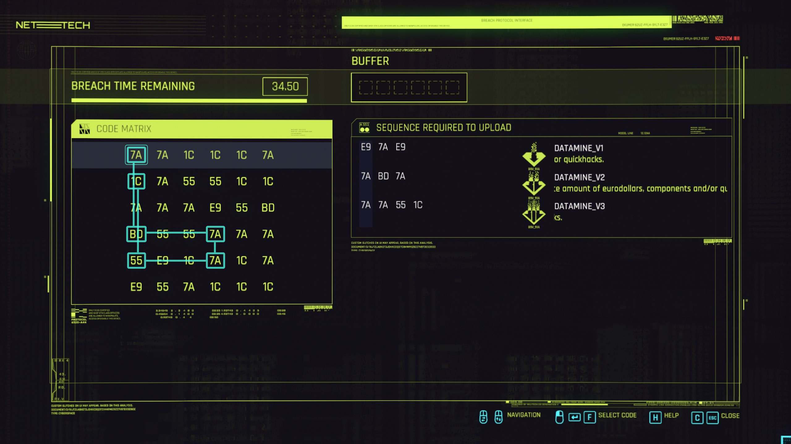

# Cyberpunk Breach Protocol Solver

An application that solves and displays the solution for the breach protocol
minigame in Cyberpunk 2077.

This application uses optical character recognition (OCR) to detect the text
on your screen in order to solve the puzzle (don't worry though, it is fine-tuned
to ONLY detect the hexadecimal strings like FF BD). OCR is not a perfect science,
so it is possible detection may fail for some puzzles.

The solver algorithm guarantees the last sequence will be found (as long as it's
possible, which it should always be) and also tries to find other sequences to
maximize payout for the given buffer size.

This application is designed for Windows. It will not run on other systems.

### WARNING

This software places a transparent window on top of all other windows. If the
program crashes for any reason, it may result in you being unable to access anything
on your screen for a few moments until Windows allows you to kill the program.
Use at your own risk!

## Table of Contents

- [Installation](#installation)
- [Usage](#usage)
- [External libraries](#external-libraries)
- [License](#license)

## Installation

Download the latest release from the [releases page](https://github.com/Hawkpath/cyberpunk-breach-protocol-solver/releases)
and unzip it to a permanent location.

## Usage

You must have Java 1.8+ installed on your system.

Double click `cyberpunk_breach_solver-X.X.jar` to start the application. It will
run in the background while you play the game.

Once you are in a breach protocol puzzle, press `5` on your keyboard to detect
and solve the puzzle. If everything works out, you should see the puzzle solution
appear on top of the game. To clear the solution after you're done, press `0`.

When you're done with the program, you can close it from the taskbar (since it
has no visible window).

### Keybinds

You can change the default keybinds in the `config.txt` file. The defaults were
chosen with the numpad in mind.

Key | Purpose
--- | -------
5 | Find and display the solution to the breach protocol puzzle on the screen
0 | Clear the solution from the screen
9 | Force the solution to display on top of the game (in case it's stuck in the background)

## External libraries

This application uses the following external libraries:

- [Apache Commons Text](https://commons.apache.org/proper/commons-text/)
- [Combinatoradix](https://github.com/dakusui/combinatoradix)
- [Java Native Access (JNA)](https://github.com/java-native-access/jna)
- [JNativeHook](https://github.com/kwhat/jnativehook)
- [SLF4J](http://www.slf4j.org/)
- [Tess4J](http://tess4j.sourceforge.net/)
- [Tesseract](https://github.com/tesseract-ocr/tesseract)

Apache Commons Text, Combinatoradix, Java Native Access, Tess4J, and Tesseract
are licensed under the Apache 2.0 License, which may be obtained from
<http://www.apache.org/licenses/LICENSE-2.0>.

JNativeHook is licensed under both the GNU General Public License and the GNU Lesser
General Public License, which may be obtained from <https://www.gnu.org/licenses/gpl-3.0.en.html>
and <https://www.gnu.org/licenses/lgpl-3.0.en.html>, respectively.

SLF4J is licensed under the MIT license.

## License

[MIT © Hawkpath.](LICENSE)
